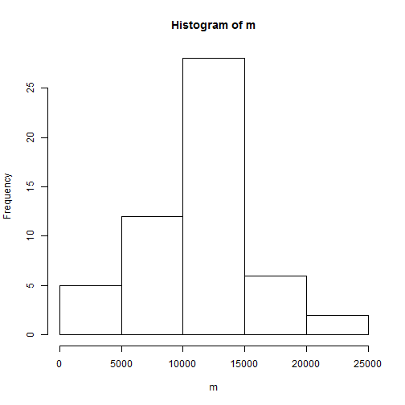
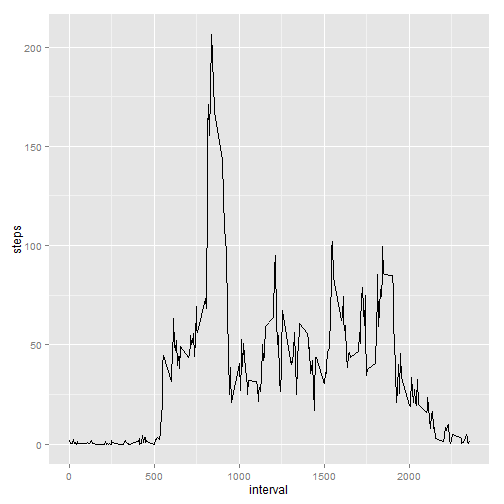
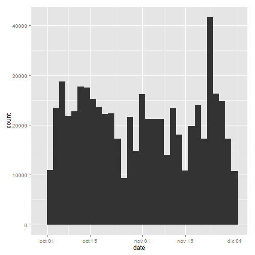
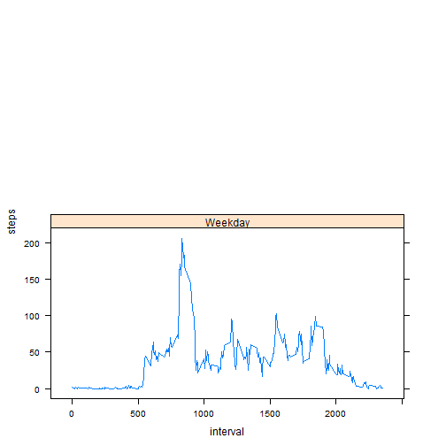

# Reproducible Research: Peer Assessment 1


## Loading and preprocesing data

### Loading


```r
packages <- c("data.table", "ggplot2", "xtable", "VIM")
sapply(packages, require, character.only=TRUE, quietly=TRUE)
```

```
## data.table 1.9.4  For help type: ?data.table
## *** NB: by=.EACHI is now explicit. See README to restore previous behaviour.
## VIM is ready to use. 
##  Since version 4.0.0 the GUI is in its own package VIMGUI.
## 
##           Please use the package to use the new (and old) GUI.
## 
## Suggestions and bug-reports can be submitted at: https://github.com/alexkowa/VIM/issues
## 
## Attaching package: 'VIM'
## 
## The following object is masked from 'package:datasets':
## 
##     sleep
```

```
## data.table    ggplot2     xtable        VIM 
##       TRUE       TRUE       TRUE       TRUE
```

```r
fileUrl <- "https://d396qusza40orc.cloudfront.net/repdata%2Fdata%2Factivity.zip"
download.file(fileUrl, destfile = "Dataset.zip", method = "curl")
```

```
## Warning: running command 'curl
## "https://d396qusza40orc.cloudfront.net/repdata%2Fdata%2Factivity.zip" -o
## "Dataset.zip"' had status 127
```

```
## Warning in download.file(fileUrl, destfile = "Dataset.zip", method =
## "curl"): download had nonzero exit status
```

```r
unzip("Dataset.zip")
```

```
## Warning in unzip("Dataset.zip"): error 1 in extracting from zip file
```

```r
activity <- read.csv("./activity.csv")
```

### Process  the data


```r
activity$date <- as.Date(activity$date)
length(activity$steps)
```

```
## [1] 17568
```

```r
summary(activity)
```

```
##      steps             date               interval     
##  Min.   :  0.00   Min.   :2012-10-01   Min.   :   0.0  
##  1st Qu.:  0.00   1st Qu.:2012-10-16   1st Qu.: 588.8  
##  Median :  0.00   Median :2012-10-31   Median :1177.5  
##  Mean   : 37.38   Mean   :2012-10-31   Mean   :1177.5  
##  3rd Qu.: 12.00   3rd Qu.:2012-11-15   3rd Qu.:1766.2  
##  Max.   :806.00   Max.   :2012-11-30   Max.   :2355.0  
##  NA's   :2304
```


## What is mean total number of steps taken per day?

> For this part ignore the missing values in
> the dataset.
>
> 1. Make a histogram of the total number of steps taken each day
>
> 2. Calculate and report the **mean** and **median** total number of steps taken per day

Aggregate the number of steps taken each day.
Days with missing values (`NA`) will have `NA` when aggregated.


```r
m<-tapply(activity$steps, activity$date,sum)
edit(head(m))
```

Plot a histogram of the total number of steps taken each day. (for understand variability between days)


```r
hist(m)
```

 

Calculate the mean and median total number of steps taken per day **before imputing**.


```r
summary(m)
```

   Min. 1st Qu.  Median    Mean 3rd Qu.    Max.    NA's 
     41    8841   10760   10770   13290   21190       8 


## What is the average daily activity pattern?

> 1. Make a time series plot (i.e. `type = "l"`) of the 5-minute interval (x-axis) and the average number of steps taken, averaged across all days (y-axis)
>
> 2. Which 5-minute interval, on average across all the days in the dataset, contains the maximum number of steps?

Aggregate the average number of steps taken by 5-minute interval.


```r
average_steps<-data.frame(cbind(activity$interval,
tapply(activity$steps, activity$interval, mean, na.rm = TRUE)))
colnames(average_steps) <- c("interval","steps")
```

Plot a time series of the 5-minute interval and the average number of steps taken across all days.


```r
q<-ggplot(data=average_steps,aes(x=interval,y=steps)) +
  geom_line()
print(q)
```

 


## Imputing missing values

1. Calculated missing


```r
table(is.na(activity$steps))
```

```
## 
## FALSE  TRUE 
## 15264  2304
```

2. Filling in all dataset

Use the mean of interval, to replace the missing values.


```r
mfixed<-activity
mfixed[is.na(mfixed[, 1]), 1]<-average_steps[is.na(mfixed[, 1]),2]
```

Create a histogram of the new dataset, which has the NAs replaced with the 5-minute means.


```r
qplot(date, weight=mfixed$steps, data=mfixed, geom="histogram")
```

```
## stat_bin: binwidth defaulted to range/30. Use 'binwidth = x' to adjust this.
```

 

Calculate and report the mean and media values. We can see that the values differ from the initial calculation, and have higher value. It is also observed in the graph above. Most days have an increased number of mean of steps, since the NAs have been replaced by the 5-minute interval mean.


```r
mean(tapply(mfixed$steps, mfixed$date, sum, na.rm = TRUE))
```

```
## [1] 10766.19
```

```r
median(tapply(mfixed$steps, mfixed$date, sum, na.rm = TRUE))
```

```
## [1] 10766.19
```

## Are there differences in activity patterns between weekdays and weekends?


```r
library(lattice)
mfixed$day<-as.factor(ifelse(weekdays(mfixed$date) %in% c("Saturday","Sunday"),"Weekend","Weekday"))
```
Plot the 5-minute average of steps, by weekday/weekend.

```r
xyplot(steps ~ interval | day, aggregate(steps ~ interval + day, mfixed, FUN = mean), 
layout = c(1, 2), type = "l", group=day)
```

 

